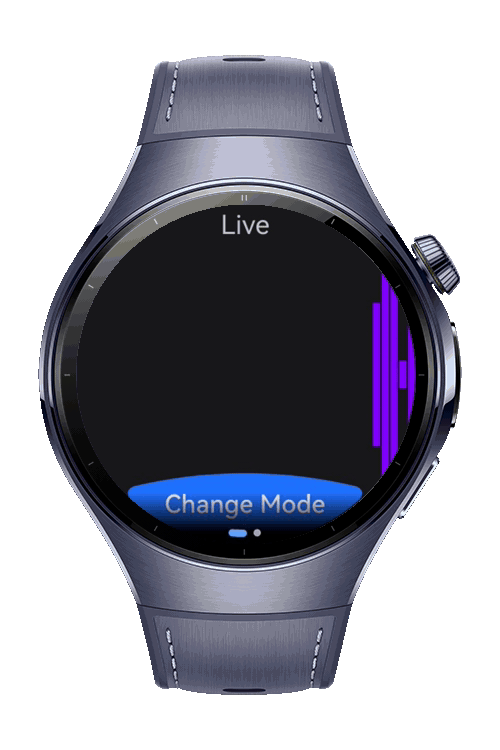

> **Note:** To access all shared projects, get information about environment setup, and view other guides, please visit [Explore-In-HMOS-Wearable Index](https://github.com/Explore-In-HMOS-Wearable/hmos-index).

# How To Make Sound-Wave

This codelab shows how to create linear and circular sound wave animations.

# Preview

<div>
  
</div>

# Use Cases

- Simulate live and random sound waves with linear and circular animations using the canvas.

# Tech Stack

- **Languages**: ArkTS, ArkUI
- **Frameworks**: HarmonyOS SDK 5.0.2(14)
- **Tools**: DevEco Studio Vers 5.1.0.828
- **Libraries**: @kit.ArkUI

# Directory Structure

```
\entry\src\main\ets
├───components
│       CircularWaveAnimation.ets
│       LinearWaveAnimation.ets
├───entryability
│       EntryAbility.ets
├───entrybackupability
│       EntryBackupAbility.ets
├───pages
│       Index.ets
└───viewmodel
        CircularWaveVM.ets
        WaveVM.ets
```

# Constraints and Restrictions

## Supported Device

* Huawei Watch 5

# License

**SoundWave Codelab** is distributed under the terms of the MIT License
See the [LICENSE](./LICENSE) for more information.